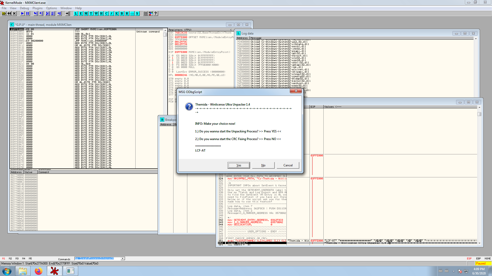

# Upacking MxM v12147

First things first, we need to know what we're dealing with, so we drop MxMClient.bin (rename it to \*.exe)  into [DIE](https://github.com/horsicq/Detect-It-Easy).

  

As expected, this is a PE x86 binary file. It is however packed by **Obsidium** *and* **Themida**.

**Obsidium**: https://www.obsidium.de/

* Not widely used as far as I can tell
* Unpack scripts stop at version 1.4 (which is old) and we don't know which version was used

**Themida**: https://www.oreans.com/

* Widely used, very strong packer (64bit version is close to impossible to unpack)
* Good unpacking scripts for the 32bit version (2.X)

 

# Obsidium

Opening up the binary in x64dbg and stepping does not help much. Even with ScyllaHide, the Anti-Debugging protection prevents any progress.

  

 

So we need a better setup:

* Windows 7 SP1 x86 (32bit) VM
* OllyDbg with **Phantom** + **StrongOD** plugins

Trying the different Obsidium scripts make one thing clear, they don't work at all. They don't even *begin* to work. Apparently people are reversing the newer versions by hand (writing OllyDbg scripts), so let's try that.

We first need to observe the packer inner workings. I first ran [hasherezade's tiny tracer PIN tool](https://github.com/hasherezade/tiny_tracer), to see if the unpacked binary data was transferred to a new thread or process (that we could then dump). It is not. The crash handler is the only new process created.

Then I slowly stepped through the packer execution in OllyDbg. One trick is to put a breakpoint on **VirtualAlloc** since packers create a memory region for the unpacked binary data. Lots of memory regions are created, nothing obvious jumps out to me... Until a few memory regions are created with small seemingly random names. Now I have already dealt with Themida packed binaries before and they also exhibit a similar behaviour. Could it be that **DIE** incorrectly detected **Obsidium**?

 

# Themida

Let's try a Themida unpacking script from [LCF-AT](https://zenhax.com/viewtopic.php?t=1051).
It is very well done and asks a few questions along the way to configure it.

  

**INFO: SetEvent AntiDump Finder**
> No

Then just follow the script instructions...

  

**Do you want to bypass the VMWare checks?**
> Yes

**Magic Find Method**
> Yes

**Disable the NOPPER check**
> No

The script has now recovered the original IAT at **0x277A000** with a size of **0x1528**.
The script asks us to verify those values and they seem correct.
  

**Do you wanna let fix all found direct API JUMPs to Direct JUMPs**
> No

**Check for optimizing**
> No

And..... The file is dumped! (?)
  

Now if you're lucky the dumped file might just start and work right away, but it is not shareable. It sill runs through the Themida voodoo magic, but the locally dumped version, so offsets are wrong.