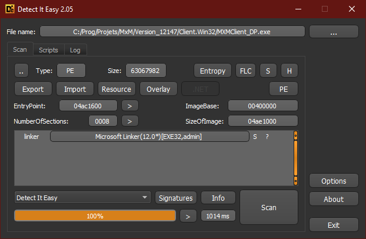
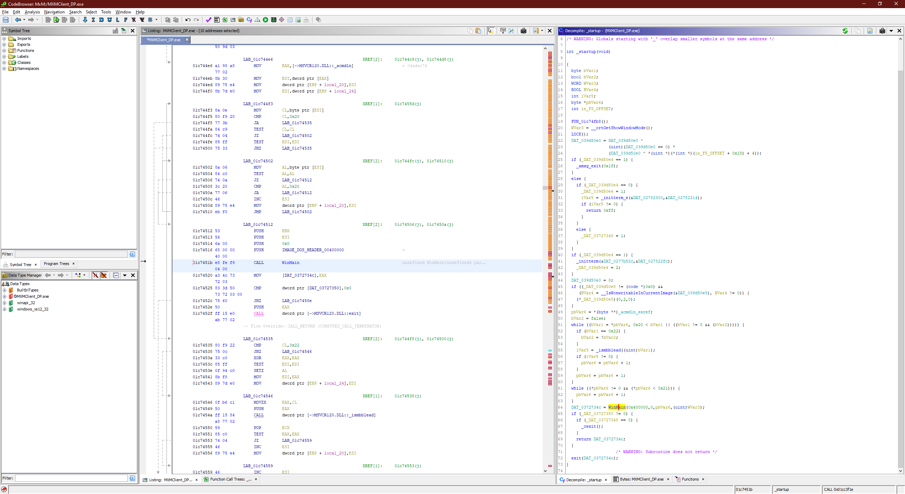
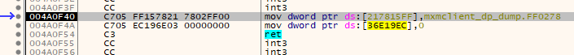

# Part 2

So now that we seemingly got rid of Themida, let's see how it looks in **DIE**.

  

No Themida, no Obsidium, it looks good.

# Entry Point

However as mentioned before, we still run through the dumped Themida code, we need to find the correct orginal (pre-packing) **Entry Point** (OEP). Finding it can be a challenge, but now that we dumped the binary we can load it into **Ghidra** and analyse it.
We need to find **WinMain()** or rather the function calling it. I managed to find it after a mix of OllyDbg stepping/breaking and Ghidra analysis. Now that the file is dumped, we know where the unpacked binary code ends up, so we can set a **Memory breakpoint (write)** at the address we want to break to (let's say 0x1c743f1). The memory breakpoint will trigger on a weird instruction, just press F7 a few times so it can unpack a few bytes then go back to your address (0x1c743f1) and put a normal breakpoint this time. This works because Themida first unpacks *then* jumps to the actual code. Anyway, the **Entry point** seems to be **0x1c743f1**.

  

Now that we found the **Entry Point** we need to apply it. We open up the dump in **x64dbg** and run it until it breaks on the entry point (the wrong one) then open **Scylla** (the [S] icon). We put the correct **OEP** and **IAT** we found earlier.
Then **[Get Imports]** and **[Dump]**.

# Fix 1

Starting up the new dump, it crashes trying to access an invalid memory location.

  

Breaking at this address on the original executable in OllyDbg shows the memory address has been altered by either Scylla or the unpack script. So we fix it (copy it from OllyDbg).

After the fix we start again and we see the splash screen! Victory. But it crashes right after. When debugging with x64dbg we trip again on Anti-Debug protection, it must be the Anti cheat system (Game Guard) at play. So let's remove it.