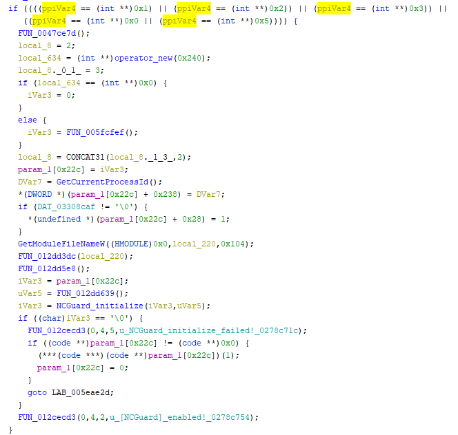
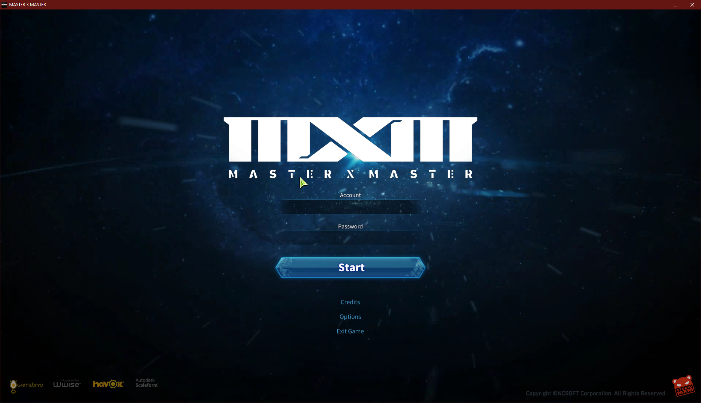

# Part 3

We'll now remove Game guard and hopefully everything goes well. First off let's remove the Aegisty files and Gameguard.des. Expectedly, the game closes instantly after booting up. 

# Fix 2

Fortunately for us the binary strings are in plain text. So even though the RTTI information has been stripped, we can still recover a lot of useful information.

  

Here we can see that we check if a number is equal to either 0,1,2,3 or 5, then we initialize NCGuard. Let's patch the binary so we never enter this condition. And it works surprisingly well.

# Fix 3

We however trigger a few instances of the same exception (**0x406D1388**). When skipping them the game launches, but only via the debugger. It turns out this [exception is used as a way to name threads](https://docs.microsoft.com/en-us/visualstudio/debugger/how-to-set-a-thread-name-in-native-code?view=vs-2019) and apparently only works with a debugger attached. So lets patch it.

And victory once again! We now have a (seemingly) working client, fully debuggable and unpacked.

  
